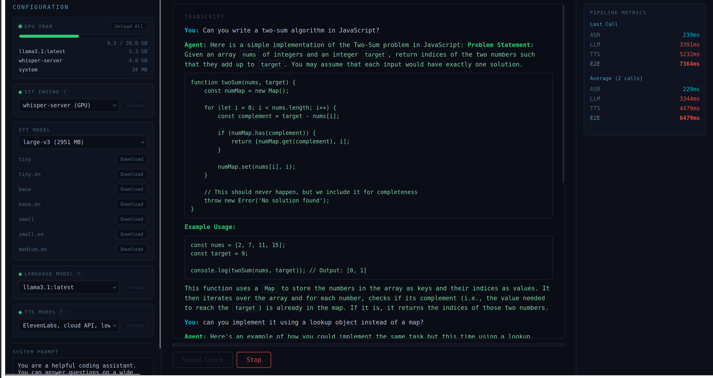

# ASR-LLM-TTS Pipeline

Real-time voice pipeline for call center automation, built for AMD GPUs via ROCm. Speak into the mic, get a transcription via ASR, a response from an LLM (Ollama), and hear it spoken back via TTS.



## Pipeline stages

1. **ASR (Speech-to-Text)** — Converts voice audio into text. Choose between whisper-server (GPU, ROCm) or faster-whisper (INT8, CPU).
2. **LLM (Language Model)** — Generates a conversational response from the transcript via Ollama. Thinking models are supported — reasoning is hidden from TTS and shown behind a toggle in the UI.
3. **TTS (Text-to-Speech)** — Converts the LLM reply into spoken audio. Multiple engines available from lightweight CPU to cloud API.

## TTS engines

| Engine        | Type      | Notes                                 |
| ------------- | --------- | ------------------------------------- |
| Piper Fast    | CPU       | Lowest latency (6MB)                  |
| Piper Quality | CPU       | Balanced (17MB)                       |
| Piper High    | CPU       | Most natural (109MB)                  |
| Kokoro        | CPU       | Professional quality (82M params)     |
| MeloTTS       | CPU       | Real-time, multi-accent (208M params) |
| ElevenLabs    | Cloud API | Low latency, requires API key         |

## STT engines

| Engine         | Type       | Notes                                                   |
| -------------- | ---------- | ------------------------------------------------------- |
| whisper-server | GPU (ROCm) | whisper.cpp with GPU acceleration, multiple model sizes |
| faster-whisper | CPU        | INT8 quantization, 4x speed on CPU                      |

## Architecture

Browser captures mic audio over WebSocket. The Go gateway decodes, resamples to 16kHz, and runs energy-based VAD. When speech ends, it posts to the ASR backend for transcription, streams the transcript to Ollama, and pipes each completed sentence to TTS while the LLM is still generating. Audio is sent back over WebSocket.

Each WebSocket connection gets its own goroutine with context-based cancellation. LLM and TTS stages overlap via channels for sentence-level pipelining. A semaphore caps concurrent calls (default 100), returning 503 when full.

GPU-bound services (whisper-server, Ollama) run on the host for direct ROCm access. Docker services (Piper, Kokoro, MeloTTS, faster-whisper) run in containers. The `whisper-control` host process manages whisper-server lifecycle and exposes GPU monitoring.

## Codecs

| Codec           | Rate             | Use case                                   |
| --------------- | ---------------- | ------------------------------------------ |
| PCM (16-bit LE) | Caller-specified | Browser frontend via WebSocket             |
| G.711 μ-law     | 8000 Hz          | Telephony ingest (SIP/RTP, Telnyx, Twilio) |
| G.711 A-law     | 8000 Hz          | Telephony ingest (SIP/RTP, international)  |

The browser path sends raw PCM. G.711 decoders are available for future telephony integration where SIP trunks or CPaaS APIs deliver μ-law/A-law audio.

## Setup

Build whisper.cpp (auto-detects ROCm/CUDA):

```bash
./scripts/build-whisper-server.sh
export PATH="$HOME/.local/bin:$PATH"
```

Download models:

```bash
./scripts/download-models.sh
```

Start the stack:

```bash
./run.sh
```

Open http://localhost:3001, select your STT/LLM/TTS, click Talk.

## UI features

- **Model management** — Load/unload LLM, STT, and TTS models from the UI
- **GPU panel** — Real-time VRAM usage bar and per-process GPU memory
- **Service control** — Start/stop host-managed services (whisper-server)
- **STT model download** — Download whisper models with progress from the UI
- **Thinking toggle** — Reasoning from thinking models is hidden by default, expandable via "Show reasoning" button
- **Metrics panel** — Per-stage latency (ASR, LLM, TTS) and E2E timing
- **Sound check** — VU meter for mic level verification

## Monitoring

Prometheus scrapes the gateway's `/metrics` endpoint. Grafana is pre-provisioned with a dashboard covering active calls, calls/sec, per-stage latency, E2E percentiles, error rates, and audio throughput.

- Prometheus: http://localhost:9090
- Grafana: http://localhost:3002 (admin/admin)

## Load testing

```bash
docker compose run --rm loadtest --concurrency 10 --duration 30s
```

## Config

Everything is in `.env`:

| Variable               | Default              | What it does                     |
| ---------------------- | -------------------- | -------------------------------- |
| OLLAMA_MODEL           | llama3.2:3b          | Default LLM model                |
| DEFAULT_TTS_ENGINE     | fast                 | Default TTS engine               |
| ELEVENLABS_API_KEY     | (empty)              | Enables ElevenLabs TTS when set  |
| ELEVENLABS_VOICE_ID    | 21m00Tcm4TlvDq8ikWAM | ElevenLabs voice                 |
| ELEVENLABS_MODEL_ID    | eleven_turbo_v2_5    | ElevenLabs model                 |
| MAX_CONCURRENT_CALLS   | 100                  | Admission control limit          |
| LLM_MAX_TOKENS         | 150                  | Max LLM response tokens          |
| VAD_SILENCE_TIMEOUT_MS | 1000                 | Wait after speech stops          |
| VAD_MIN_SPEECH_MS      | 500                  | Ignore audio shorter than this   |
| ASR/LLM/TTS_POOL_SIZE  | 50                   | HTTP connection pool per backend |

## Project layout

```
services/
  gateway/          Go orchestrator (WebSocket, pipeline, VAD, codecs, metrics)
  frontend/         SolidJS app (AudioWorklet mic, VU meter, transcript, GPU panel)
  piper/            Go wrapper around piper CLI with multiple voice models
  loadtest/         Concurrent call simulator
  monitoring/       Prometheus + Grafana dashboards
scripts/
  build-whisper-server.sh
  whisper-control.py    Host process for whisper-server lifecycle + GPU monitoring
cmd/
  whisper-control/      Go HTTP wrapper for whisper-control.py
```
