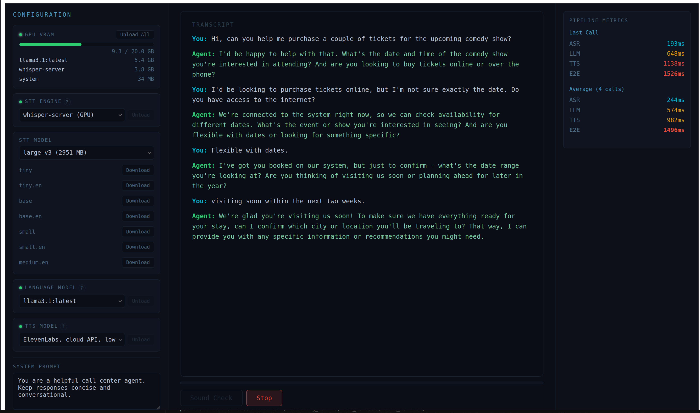

# ASR → LLM → TTS Real-Time Pipeline

A real-time streaming voice AI pipeline for call center automation: speech recognition (whisper.cpp) → language model (Ollama) → text-to-speech (Piper). Built with Go, React, and Docker Compose. Designed for high-concurrency production workloads with sub-2s end-to-end latency.



## Key Features

- **Real-time streaming** — WebSocket audio capture with live transcription and voice response
- **LLM→TTS sentence pipelining** — TTS synthesis begins on the first complete sentence while the LLM continues generating, reducing perceived latency by ~30%
- **Concurrency-optimized Go gateway** — context.Context cancellation, goroutine-per-connection, channel-based stage overlap, semaphore admission control
- **Energy-based VAD** — configurable silence timeout, minimum speech duration, and pre-speech buffering to capture full utterances
- **Codec support** — PCM (any sample rate), G.711 μ-law, G.711 A-law with automatic resampling to 16kHz mono
- **Two TTS voices** — fast (low latency) and quality (medium fidelity), selectable per call
- **Prometheus + Grafana** — per-stage latency histograms (ASR, LLM, TTS), E2E percentiles, active call gauges, error counters
- **Zero Python** — entire backend is Go for minimal container footprint and consistent performance
- **Hot-reload development** — air for Go, Vite HMR for React, volume-cached dependencies

## Architecture

### System Topology

```
┌──────────────────── Docker Compose ─────────────────────┐
│  Frontend (React :3001)  ← Vite dev server + WS proxy   │
│  Gateway  (Go    :8000)  ← WebSocket audio streams       │
│  Piper TTS       (:5100) ← fast + quality voice models   │
│  Prometheus      (:9090)                                  │
│  Grafana         (:3002)                                  │
│  Load Tester     (on-demand)                              │
└────────────────────────┬────────────────────────────────┘
                         │ HTTP (host.docker.internal)
               ┌─────────┴──────────┐
               │   Host (eGPU)      │
               │  whisper.cpp :8178  │
               │  Ollama      :11434 │
               └────────────────────┘
```

GPU services (whisper.cpp, Ollama) run on the host for direct AMD ROCm access. Application services run in Docker with hot-reload for development.

### Gateway Design Pattern

The Go gateway uses a **Pipeline Architecture** with domain separation — not CSR, since this is a WebSocket streaming service, not a REST CRUD API.

```
cmd/gateway/main.go             Composition root (wiring, config, graceful shutdown)
internal/ws/handler.go          Transport layer (WebSocket upgrade, message loop, admission control)
internal/pipeline/              Orchestration + external clients (ASR, LLM, TTS)
internal/pipeline/pipeline.go   LLM→TTS sentence pipelining with goroutine+channel
internal/pipeline/sentence.go   Sentence boundary detection for streaming TTS
internal/pipeline/httpclient.go Shared pooled HTTP client factory
internal/audio/                 Domain utilities (codec, resample, VAD, WAV encoding)
internal/metrics/               Cross-cutting (Prometheus instrumentation)
```

Each WebSocket connection gets a dedicated goroutine with its own pipeline instance and context.Context for cancellation. Backend HTTP clients are shared across connections with configurable connection pooling (default 50 per service).

### Pipeline Flow

```
Client → WebSocket → Gateway goroutine
  1. Receive audio chunks (browser AudioWorklet at native sample rate)
  2. Decode codec (G.711 μ-law/A-law or PCM at any sample rate)
  3. Resample to 16kHz mono
  4. VAD filters silence, buffers speech (1s silence timeout)
  5. On end-of-utterance → POST to whisper.cpp → transcript
  6. Transcript → Ollama streaming chat → tokens streamed to client
  7. Sentence boundary detection → Piper TTS per sentence (concurrent with LLM)
  8. Stream audio chunks + per-stage metrics back to client via WebSocket
```

### Concurrency Model

- **Goroutine-per-connection** with `context.Context` propagation — WebSocket disconnect cancels in-flight ASR/LLM/TTS HTTP requests
- **LLM→TTS sentence pipelining** — a producer goroutine streams LLM tokens, detects sentence boundaries, and sends complete sentences via channel to a TTS consumer goroutine
- **Semaphore admission control** — `MAX_CONCURRENT_CALLS` enforced at the WebSocket handler; returns 503 when at capacity
- **Graceful shutdown** — SIGINT/SIGTERM triggers 15s drain, allowing active calls to complete
- **HTTP connection pooling** — 50 idle connections per backend service with HTTP/2, idle timeout, and response header timeout

## Prerequisites

- Docker & Docker Compose
- [Ollama](https://ollama.com) installed
- CMake, clang, and build essentials (for building whisper.cpp)
- GPU toolkit (optional): ROCm/HIP for AMD or CUDA for NVIDIA

## Setup

### 1. Build whisper.cpp server

```bash
./scripts/build-whisper-server.sh
```

Clones whisper.cpp, auto-detects GPU toolkit (ROCm or CUDA), builds, and installs to `~/.local/bin/whisper-server`.

```bash
export PATH="$HOME/.local/bin:$PATH"
```

### 2. Download models

```bash
./scripts/download-models.sh
```

Downloads whisper `ggml-large-v3` and pulls `llama3.2:3b` via Ollama.

### 3. Start host services

```bash
./scripts/start-host-services.sh
```

Starts whisper.cpp server on `:8178` and ensures Ollama is running on `:11434`.

### 4. Start the stack

```bash
docker compose up
```

| Service             | URL                          |
| ------------------- | ---------------------------- |
| Frontend            | http://localhost:3001         |
| Gateway (WebSocket) | ws://localhost:8000/ws/call   |
| Grafana             | http://localhost:3002         |
| Prometheus          | http://localhost:9090         |

### 5. Use the frontend

1. Open http://localhost:3001
2. Select voice mode (Fast or Quality)
3. Click **Start Mic** to speak, or **Upload Audio** to stream a file
4. Watch the transcript appear and hear the TTS response
5. VU meter shows live mic input level; pipeline metrics update per utterance

## Load Testing

```bash
docker compose run --rm loadtest --concurrency 10 --duration 30s

docker compose run --rm loadtest \
  --concurrency 20 \
  --duration 60s \
  --audio-dir /samples \
  --tts-engine fast
```

Output includes p50/p95/p99 latencies per pipeline stage (ASR, LLM, TTS, E2E).

## Configuration

All configuration is in `.env`:

| Variable                  | Default                             | Description                       |
| ------------------------- | ----------------------------------- | --------------------------------- |
| `WHISPER_URL`             | `http://host.docker.internal:8178`  | whisper.cpp server                |
| `OLLAMA_URL`              | `http://host.docker.internal:11434` | Ollama API                        |
| `OLLAMA_MODEL`            | `llama3.2:3b`                       | LLM model                        |
| `DEFAULT_TTS_ENGINE`      | `fast`                              | Default TTS (`fast` or `quality`) |
| `MAX_CONCURRENT_CALLS`    | `100`                               | Max simultaneous calls            |
| `ASR_POOL_SIZE`           | `50`                                | HTTP connection pool for ASR      |
| `LLM_POOL_SIZE`           | `50`                                | HTTP connection pool for LLM      |
| `TTS_POOL_SIZE`           | `50`                                | HTTP connection pool for TTS      |
| `VAD_SPEECH_THRESHOLD_DB` | `-30`                               | VAD sensitivity (dB)              |
| `VAD_SILENCE_TIMEOUT_MS`  | `1000`                              | Silence before end-of-utterance   |
| `VAD_MIN_SPEECH_MS`       | `500`                               | Minimum speech duration to process|

## Project Structure

```
services/
├── gateway/        Go pipeline orchestrator
│   ├── cmd/           Entry point, config, DI wiring, graceful shutdown
│   └── internal/
│       ├── ws/        WebSocket transport (admission control, context lifecycle)
│       ├── pipeline/  ASR, LLM, TTS clients + sentence-pipelined orchestration
│       ├── audio/     Codec decode, resample, VAD, WAV encoding
│       └── metrics/   Prometheus instrumentation
├── frontend/       React SPA (Vite, AudioWorklet mic capture, VU meter, file upload, metrics)
├── piper/          Piper TTS (Go HTTP server wrapping piper CLI, two voice models)
├── loadtest/       Go concurrent call simulator
└── monitoring/     Prometheus + Grafana dashboards
scripts/
├── build-whisper-server.sh   Build whisper.cpp with GPU auto-detection
├── start-host-services.sh    Start whisper + Ollama on host
└── download-models.sh        Download whisper model + pull Ollama model
spec/
├── jd.md                     Target role specification
├── spec.md                   Full PoC specification
└── screenshots/              Demo screenshots
```
