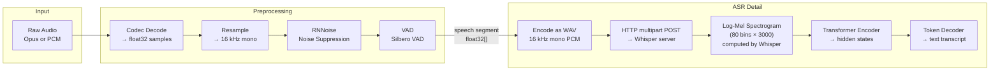
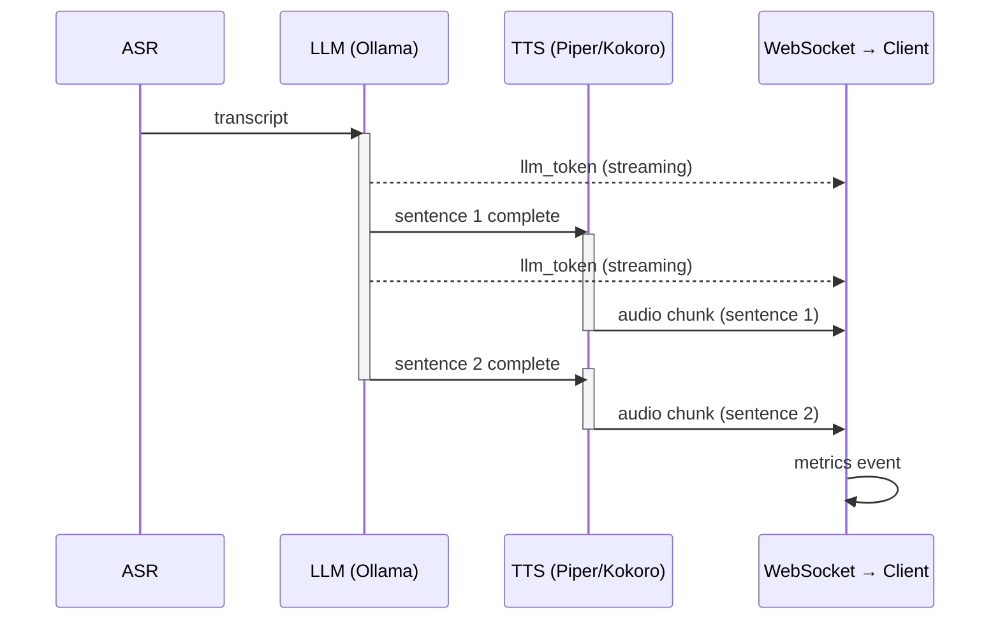

# Pipeline Architecture

## End-to-End Flow

```mermaid
flowchart LR
    subgraph Browser
        MIC[Microphone]
        SPK[Speaker]
        UI[CallPanel UI]
    end

    subgraph Gateway ["Gateway (Go)"]
        direction TB
        WS[WebSocket Handler]
        DEC[Decode Opus/PCM]
        RS[Resample → 16 kHz]
        DN[RNNoise Denoise]
        VAD[Voice Activity Detection]
    end

    subgraph Pipeline ["Pipeline Stages"]
        direction TB
        ASR[ASR — Whisper]
        LLM[LLM — Ollama]
        TTS[TTS — Piper / Kokoro]
        CLS[Audio Classification]
    end

    MIC -- "binary audio" --> WS
    UI -- "callMetadata JSON\n(first frame)" --> WS
    WS --> DEC --> RS --> DN --> VAD

    VAD -- "speech ended" --> ASR
    VAD -- "parallel" -.-> CLS

    ASR -- "transcript" --> LLM
    LLM -- "sentence pipelining" --> TTS

    TTS -- "audio bytes" --> WS
    ASR -- "transcript event" --> WS
    LLM -- "llm_token events" --> WS
    CLS -. "emotion event" .-> WS

    WS -- "events + audio" --> SPK
    WS -- "events" --> UI
```

## Audio Processing Detail



## Sentence Pipelining (LLM + TTS)

The LLM and TTS stages are **not** fully sequential. The gateway uses sentence pipelining — TTS begins synthesizing the first complete sentence while the LLM continues generating.



## WebSocket Event Types

| Event | Direction | Payload |
|-------|-----------|---------|
| `callMetadata` | client → server | JSON: codec, sample_rate, engines, mode, prompts |
| binary frame | client → server | Encoded audio (Opus/PCM) |
| `transcript` | server → client | ASR text, latency |
| `llm_token` | server → client | Streaming token |
| `llm_done` | server → client | Full response text |
| `tts_ready` | server → client | Binary audio bytes |
| `emotion` | server → client | Audio classification result |
| `metrics` | server → client | ASR/LLM/TTS/total latency (ms), WER, no_speech_prob |

## Latency Breakdown

```mermaid
gantt
    title Typical E2E Latency (~2s)
    dateFormat X
    axisFormat %L ms

    section Sequential
    ASR (Whisper)           :active, asr, 0, 200
    LLM TTFT + generation   :active, llm, 200, 1700
    TTS sentence 1          :active, tts, 1700, 2050

    section Parallel
    Audio Classification    :done, cls, 0, 150
    TTS sentence 2          :active, tts2, 1900, 2200
```


