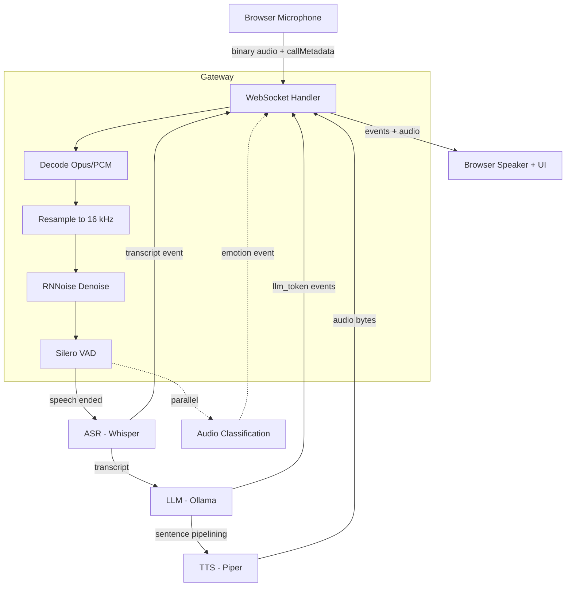
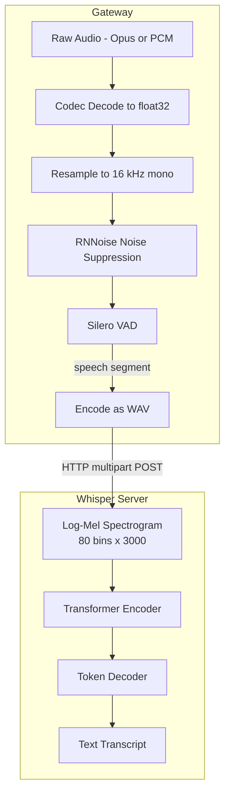
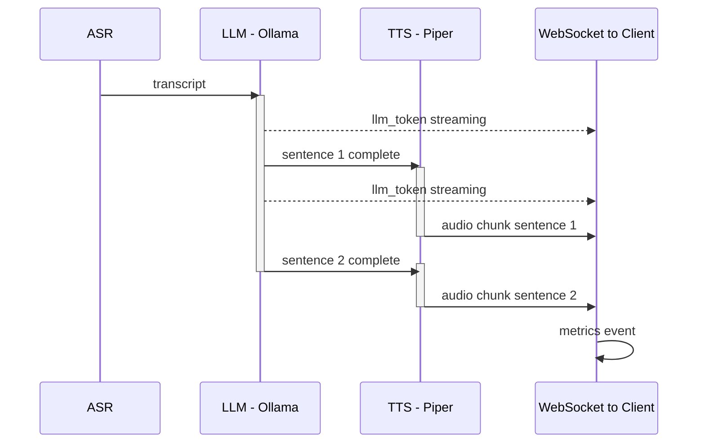

# Pipeline Architecture

## End-to-End Flow

## Audio Processing Detail

## Sentence Pipelining (LLM + TTS)

The LLM and TTS stages are **not** fully sequential. The gateway uses sentence pipelining: TTS begins synthesizing the first complete sentence while the LLM continues generating.

## WebSocket Event Types

| Event | Direction | Payload |
|-------|-----------|---------|
| `callMetadata` | client to server | JSON: codec, sample_rate, engines, mode, prompts |
| binary frame | client to server | Encoded audio (Opus/PCM) |
| `transcript` | server to client | ASR text, latency |
| `llm_token` | server to client | Streaming token |
| `llm_done` | server to client | Full response text |
| `tts_ready` | server to client | Binary audio bytes |
| `emotion` | server to client | Audio classification result |
| `metrics` | server to client | ASR/LLM/TTS/total latency ms, WER, no_speech_prob |

## Latency Breakdown

```mermaid
gantt
    title Typical E2E Latency
    dateFormat X
    axisFormat %L ms

    section Sequential
    ASR Whisper              :active, asr, 0, 200
    LLM TTFT + generation    :active, llm, 200, 1700
    TTS sentence 1           :active, tts, 1700, 2050

    section Parallel
    Audio Classification     :done, cls, 0, 150
    TTS sentence 2           :active, tts2, 1900, 2200
```

